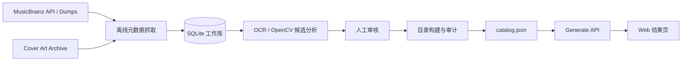

# CoverTune：用专辑封面拼出你的名字

> 可直接交给编码 AI 的 Spec-first 产品与技术规格  
> 版本：v1.0 Draft  
> 日期：2026-07-24  
> 默认语言：简体中文  
> MVP 目标：用户输入 1–10 个英文字母，立即获得一组能够在视觉上“拼出”这些字母的真实音乐专辑封面，并发现对应音乐。
>
> 原型进度（2026-07-25）：A–Z 已各有至少 3 张完成原型视觉预筛的候选，
> 当前共 111 张；“换一组”按 seed 在单字母候选池中轮换。生产上线前仍须
> 达到第 9.3 节的更高覆盖与版权审核标准。

---

## 0. 给编码 AI 的执行约定

这份文档是当前项目的唯一产品真相源（source of truth）。

编码 AI 开始前必须：

1. 完整阅读本文档。
2. 先输出不超过 15 行的实现计划、计划创建的目录结构、仍需假设的事项。
3. 若文档没有明确规定，优先选择最简单、可本地运行、可测试、无付费依赖的方案。
4. 不得擅自扩大 MVP 范围，不得增加登录、付费、社交、内嵌完整音乐播放等功能。
5. 不得编造 MusicBrainz MBID、专辑资料或版权状态。测试数据必须明确标为 fixture；正式目录数据必须来自真实接口并保留来源 URL。
6. 每完成一个里程碑都运行对应测试；最后提供启动命令、测试命令、已知限制和下一步建议。

若实现与本规格冲突，以“验收标准”章节为最终判断依据。

---

## 1. 产品摘要

### 1.1 一句话介绍

输入你的英文名字，CoverTune 会为每一个字母挑选一张真实专辑封面：封面中的文字、线条、人物姿态、圆形、三角形或其他构图，会在视觉上对应那个字母。

### 1.2 产品体验

例如用户输入：

```text
JON
```

页面返回 3 张封面：

- 第 1 张像 `J`
- 第 2 张可能用圆形构图代表 `O`
- 第 3 张可能用两条斜线和一条中线代表 `N`

每张封面下方显示专辑、音乐人、所代表的字母和匹配原因。用户可以打开 MusicBrainz 页面了解专辑，也可以重新生成另一组结果。

### 1.3 产品承诺

“专属音乐”在 MVP 中是一种由名字触发的趣味发现体验，不代表基于听歌历史或心理画像的个性化推荐。产品文案不得暗示系统理解了用户真实的音乐品味。

### 1.4 暂定产品名

- 英文名：CoverTune
- 中文副标题：用专辑封面拼出你的名字
- 名称只是工作名，代码中应将产品名集中配置，便于之后替换。

---

## 2. 背景、问题与目标

### 2.1 用户问题

常规音乐推荐以流派、歌手或收听历史为入口，结果有用但缺少“可以截图分享”的惊喜。这个项目希望用名字作为入口，把视觉谜题与音乐发现结合起来。

### 2.2 MVP 目标

- 用户在 10 秒内理解玩法。
- 用户只输入名字即可得到结果，不需要注册。
- 每个有效字母都对应一张真实专辑封面。
- 每次结果既像一个视觉谜题，又能导向真实音乐资料。
- 结果状态保存在 URL 中，并可生成一张适合分享的图片。
- 在第三方音乐数据服务暂时不可用时，已经构建好的结果仍可生成。

### 2.3 成功指标

MVP 上线后建议观察：

- 有效输入到成功生成结果的完成率 ≥ 95%。
- 已有封面目录下，结果 API 的 P95 响应时间 < 500 ms。
- 封面图片可用率 ≥ 98%。
- “换一组”点击率，用于判断用户是否愿意继续探索。
- 分享按钮点击率。
- 用户对单张匹配点击“像 / 不像”的比例，作为后续改进视觉匹配的依据。

以上指标只定义事件和目标，不要求 MVP 接入第三方分析 SDK。开发环境可使用匿名、本地日志验证。

---

## 3. 范围

### 3.1 MVP 必须包含

- 单页首页与结果体验。
- 支持 1–10 个拉丁英文字母 A–Z，不区分大小写。
- 输入规范化与明确的错误提示。
- 每个字母匹配一张真实专辑封面。
- 相同字母优先使用不同封面。
- 结果中显示专辑名、音乐人、字母、匹配原因和来源链接。
- “换一组”功能。
- 可把结果区域导出为 PNG。
- 移动端与桌面端自适应。
- 完整的加载、空数据、封面加载失败、服务异常状态。
- 一个离线数据管线，用于获取专辑元数据、分析封面、审核字母标签并生成可部署的静态目录。
- 基础单元测试、接口测试和端到端测试。
- 无障碍基础支持：键盘操作、可见焦点、替代文本、合理对比度、减少动态效果。

### 3.2 MVP 明确不包含

- 用户账号、头像、个人资料。
- 保存历史记录到服务器。
- 根据听歌历史做个性化推荐。
- 在站内播放完整音乐。
- 抓取 Spotify、Apple Music 或其他商业平台页面。
- 允许用户上传任意图片。
- 用户公开评论或社交信息流。
- 用户直接修改正式封面标签。
- 在用户请求期间运行 OCR、CLIP 或复杂视觉模型。
- 中文汉字、数字、emoji 或其他书写系统。
- 对外声称封面图片是开源图片或可自由商用。

### 3.3 后续版本候选

- 增加数字 0–9。
- 用户选择心情或流派，影响同一字母下的专辑选择。
- 对接合法的试听预览或外部播放链接。
- 支持 ListenBrainz 用户授权后的真正个性化音乐推荐。
- 支持中文名字的拼音转换，但必须让用户确认转换结果。
- 公开的“封面像什么字母”众包投票。

---

## 4. 核心用户故事

### US-01：生成名字封面

作为第一次访问的用户，我想输入自己的英文名字，以便快速得到一组专辑封面拼成的名字。

### US-02：理解为什么匹配

作为用户，我想知道某张封面为什么代表某个字母，以便理解这个视觉谜题，而不是只看到随机专辑。

### US-03：发现音乐

作为用户，我想看到专辑和音乐人信息，并打开可信来源，以便继续了解这张专辑。

### US-04：换一组

作为用户，我想在不重新输入名字的情况下获得另一组封面，以便探索更多音乐。

### US-05：分享

作为用户，我想导出结果图片，以便把结果发给朋友。URL 中保留名字与
seed，但原型界面不提供独立的“复制”按钮。

### US-06：反馈匹配质量

作为用户，我想对某张封面选择“像”或“不像”，以便帮助系统未来改进。MVP 只需在本地记录或通过可替换的轻量接口接收匿名反馈，不要求管理后台统计页。

---

## 5. 输入规则

### 5.1 接受的输入

- 原始输入最多 30 个字符，避免粘贴异常大文本。
- 去掉首尾空白。
- 忽略名字中间的普通空格、连字符 `-` 和英文撇号 `'`，但结果标题保留用户原始的可读写法。
- 将字母转为大写后参与匹配。
- 规范化后必须包含 1–10 个 ASCII 字母 `A-Z`。

示例：

| 原始输入 | 规范化结果 | 是否接受 |
|---|---:|---|
| `Jon` | `JON` | 是 |
| `A-Li` | `ALI` | 是 |
| `O'Neil` | `ONEIL` | 是 |
| `  Mia  ` | `MIA` | 是 |
| `A B` | `AB` | 是 |
| `J0N` | — | 否，数字不在 MVP 范围 |
| `小明` | — | 否，提示当前仅支持英文字母 |
| `ABCDEFGHIJK` | — | 否，规范化后超过 10 个字母 |

### 5.2 错误文案

- 空输入：`先输入一个英文名字吧`
- 存在非法字符：`目前只支持英文字母；空格、连字符和英文撇号会被自动忽略`
- 超过 10 个字母：`最多输入 10 个字母`
- 目录无法覆盖某个字母：`我们还没为字母 {LETTER} 找到足够合适的封面，请换个名字或稍后再试`

### 5.3 隐私

- 默认不把用户输入持久化到数据库。
- 服务端日志不得记录原始名字；如需统计，只记录字符数量、成功/失败、缺失字母和不可逆的短期哈希。
- 分享链接允许包含规范化名字和结果种子，因为这是用户主动发起的操作。

---

## 6. 页面与交互规格

### 6.1 首页初始状态

首屏包含：

1. 产品名和一句话说明。
2. 一个醒目的单行输入框。
3. 主按钮：`寻找我的音乐`
4. 三张示意封面或轻量动画，用来解释“一张封面代表一个字母”。
5. 数据来源简述：`音乐资料来自 MusicBrainz，封面来自 Cover Art Archive。`

输入框要求：

- `maxlength=30`
- 占位文字：`输入英文名字，最多 10 个字母`
- 按 Enter 可提交。
- 自动关闭拼写纠正，但不阻止移动端字母键盘。
- 输入过程中显示规范化后的有效字母计数，例如 `4 / 10`。

### 6.2 加载状态

- 提交后按钮进入加载状态，文案为 `正在翻唱你的名字…`
- 显示与字母数量相同的封面骨架。
- 若接口在 150 ms 内返回，可不显示骨架，避免闪烁。
- 禁止重复提交，但允许用户返回修改。

### 6.3 结果状态

结果页或同页结果区包含：

- 标题：`{DISPLAY_NAME}，这是你的专属封面歌单`
- 一排或网格形式的封面卡片，顺序严格对应规范化字母顺序。
- 每张卡片：
  - 封面图。
  - 小号字母标签，例如 `代表 O`；标签不能覆盖封面的主体区域。
  - 专辑名。
  - 音乐人。
  - 一句不超过 40 个中文字的匹配原因。
  - `查看音乐资料`链接，默认打开 MusicBrainz release group 页面。
  - 可选的外部试听链接；只有目录中存在经过允许的 URL 时才显示。
- 操作按钮：
  - `换一组`
  - `保存图片`
  - `重新输入`

封面布局：

- 1–5 个字母：桌面端优先保持单行。
- 6–10 个字母：桌面端允许 5 列换行。
- 移动端使用横向可滚动的“名字胶片”作为主展示，同时在下方提供可完整浏览的卡片列表。
- 不应为了塞入一行而把封面缩小到无法辨认。

### 6.4 匹配解释

匹配原因只能来自审核过的标签数据，不允许在请求时由大模型临时编造。

可用解释模板：

- `封面中央的圆形构图像字母 O`
- `两条斜线与横线形成了 A 的轮廓`
- `人物姿态形成了近似 Y 的剪影`
- `封面文字中出现了醒目的 R`

解释分为四类：

- `explicit`：封面中明确出现该字母。
- `shape`：线条或轮廓接近字母。
- `symbol`：圆、十字、月牙等符号代替字母。
- `pose`：人物或物体姿态形成字母。

### 6.5 换一组

- 不改变输入。
- 为同一个字母尽量换成不同专辑。
- 每次生成得到一个新的 `seed`。
- 在当前浏览器会话内，优先避开已经展示过的 release group。
- 若候选不足，可重复使用，但 UI 不需要提示技术原因。

### 6.6 可恢复的 URL 状态

格式建议：

```text
/?name=JON&seed=7K2M9P
```

规则：

- 打开链接后自动恢复同一组结果。
- 原型不提供单独的“复制链接”按钮；用户仍可使用浏览器原生地址栏分享。
- `seed` 为 6–12 位 URL-safe 字符串。
- 算法和目录版本改变可能导致旧链接结果变化，因此结果 API 还应返回 `catalogVersion`。
- MVP 不要求永久保存结果快照。页面底部需说明：`封面目录更新后，旧链接的组合可能变化。`

### 6.7 导出 PNG

- 只导出结果海报，不导出输入框和导航。
- 海报包含产品名、显示名字、封面组合、专辑与音乐人简短信息、数据来源。
- 输出建议宽度：桌面 1600 px；移动端生成固定海报布局而不是截取当前 viewport。
- 对跨域图片导致 canvas 污染的情况必须有降级：服务端图片代理、预先允许的同源缓存，或明确提示用户稍后重试。
- 导出失败不得影响正常结果展示。

### 6.8 封面加载失败

- 单张图片失败时显示带字母的中性占位卡。
- 自动尝试一次备用尺寸 URL。
- 不应让整个结果请求失败。
- 占位卡仍显示专辑名、音乐人和来源链接。

---

## 7. 视觉方向

### 7.1 气质

“独立唱片店 + 字体实验室”，有音乐杂志的编辑感，但不做怀旧唱片机拟物。

关键词：

- 黑胶唱片内页
- 影印杂志
- 字母标本
- 大字号排版
- 封面本身是主角
- 少量有节奏的动效

### 7.2 视觉原则

- 页面背景使用温暖的近白色或深炭色，不能与多彩封面竞争。
- 品牌色只用于按钮、焦点和字母标签。
- 封面保持 1:1，不裁掉关键构图；使用 `object-fit: cover` 仅限已知安全的缩略图，默认 `contain` 加背景底色。
- 不在封面上叠加一个巨大的真实字母来“伪造”匹配。
- 结果的第一阅读层是封面组合，第二层才是元数据。
- 动效只用于封面逐张出现、换一组过渡和按钮反馈。
- 遵守 `prefers-reduced-motion`。

### 7.3 建议设计令牌

```text
background: #F3F0E8
surface:    #FFFCF5
text:       #171714
muted:      #6F6A60
accent:     #FF4D2E
border:     #CFC9BC
radius-sm:  8px
radius-md:  16px
shadow:     0 12px 40px rgba(23, 23, 20, 0.10)
```

字体优先使用可开源、自托管的字体。中文与拉丁字体必须有明确 fallback，避免依赖用户设备恰好安装某款字体。

---

## 8. 数据来源与版权边界

### 8.1 MusicBrainz

用途：

- release group MBID
- 专辑标题
- 音乐人
- 首次发行日期
- release group 类型
- MusicBrainz 详情页 URL

原则：

- 首选 release group，而不是某个地区或版本的 release，避免同一专辑的多个版本重复出现。
- 只收录至少存在一张 approved front cover 的 release group。
- 生产环境的用户请求不直接调用 MusicBrainz。
- 离线抓取必须带可联系维护者的 `User-Agent`。
- 默认限速为每秒不超过 1 个 MusicBrainz 请求，并对 503 做指数退避。
- 大规模构建目录时应改用官方数据 dump，而不是持续爬取 Web Service。

官方资料：

- [MusicBrainz API](https://musicbrainz.org/doc/MusicBrainz_API)
- [MusicBrainz API 限速](https://musicbrainz.org/doc/MusicBrainz_API/Rate_Limiting)
- [MusicBrainz 数据许可](https://musicbrainz.org/doc/About/Data_License)
- [Release Group 定义](https://musicbrainz.org/doc/Release_Group)

### 8.2 Cover Art Archive

用途：

- release group 的 front cover
- 250、500、1200 px 缩略图
- 封面 approved 状态和来源 URL

建议端点：

```text
GET https://coverartarchive.org/release-group/{MBID}
GET https://coverartarchive.org/release-group/{MBID}/front-500
```

实现必须处理 307 跳转、404、503 和图片最终落到 Internet Archive 域名的情况。

官方资料：

- [Cover Art Archive API](https://musicbrainz.org/doc/Cover_Art_Archive/API)
- [Cover Art Archive 介绍](https://musicbrainz.org/doc/Cover_Art_Archive)

### 8.3 版权声明

MusicBrainz 的核心元数据大多按 CC0 提供，但封面图片不因此自动成为开源或可自由商用素材。封面可能仍受各自权利人版权保护。

MVP 必须：

- 把 MusicBrainz 与 Cover Art Archive 标为数据来源。
- 每张封面保留指向来源记录的链接。
- 不向用户提供原始高清封面下载按钮。
- 导出的结果海报只用于个人分享的产品功能；上线商业化前必须单独进行法律审查。
- 支持通过配置禁用某个 release group 或图片 URL，以响应纠错或下架请求。
- 不在营销文案中使用“开源封面图库”这一说法。

---

## 9. 可行的匹配策略

### 9.1 核心决定

用户请求时不做实时视觉识别。正式匹配只查询一个已构建、已审核的 `封面 → 字母标签`目录。

原因：

- 实时 OCR 或视觉模型会明显增加延迟与部署成本。
- 字母相似性具有主观性，纯模型结果很容易“完全不像”。
- 目录方式可解释、可测试、可屏蔽问题内容。
- 外部服务不可用时仍能生成结果。

### 9.2 两阶段管线

#### 阶段 A：候选生成

离线脚本为每张封面生成一个或多个字母候选：

1. 下载 500 px front cover 到临时缓存。
2. 检查图片尺寸、格式和损坏情况。
3. OCR 检测明确出现的 A–Z。
4. OpenCV 提取边缘、轮廓与主要几何形状。
5. 可选：用开源视觉嵌入模型对比多种字体渲染出的字母参考图。
6. 根据规则产生候选标签和置信度。

几何启发示例：

| 字母 | 可接受的视觉线索 |
|---|---|
| O | 圆、椭圆、唱片、环 |
| I | 单根明显竖线、站立人物 |
| X | 两条交叉对角线 |
| V | 向下汇聚的两条斜线、V 形姿态 |
| A | 三角轮廓加横线，或明确文字 A |
| C | 月牙、未闭合圆环 |
| T | 横线与竖线交叉 |
| Y | 上方分叉、下方单线 |

不要仅凭上述简单规则自动发布标签，它们只负责减少人工搜索范围。

#### 阶段 B：人工审核

审核者为候选选择：

- `approved`
- `rejected`
- `needs_review`

审核时必须填写或确认：

- 对应字母。
- 匹配类型。
- 0–1 的人工置信度。
- 匹配说明。
- 建议观察区域，可选。
- 是否适合公开展示。

只有 `approved` 标签进入生产目录。

### 9.3 MVP 目录最低覆盖

上线前最低要求：

- A–Z 每个字母至少 8 张 approved 封面。
- A–Z 每个字母至少 3 位不同音乐人。
- 任意单个音乐人不得占某个字母候选的 30% 以上。
- 每张封面至少有 500 px 可用缩略图。
- 目录总计不低于 208 个“字母—封面”有效关系。

建议首发目标为每个字母 15–20 张，以提高“换一组”的新鲜感。

### 9.4 标签质量

`confidence` 含义：

- `0.90–1.00`：几乎无需解释就能看出字母。
- `0.75–0.89`：仔细看可以稳定辨认。
- `0.60–0.74`：需要一句解释才能看出。
- `< 0.60`：不得进入正式目录。

正式结果默认只使用 `confidence >= 0.65` 的标签。

---

## 10. 结果选择算法

### 10.1 输入

```ts
type GenerateInput = {
  name: string;
  seed?: string;
  excludeReleaseGroupIds?: string[];
};
```

### 10.2 硬约束

对每个规范化字母：

- 标签状态必须为 `approved`。
- `confidence >= 0.65`。
- release group 未被禁用。
- cover 未被禁用。
- 图片至少有一个可用缩略图 URL。
- 同一次结果中优先不重复 release group。
- 同一次结果中同一音乐人最多出现 2 次。

### 10.3 软评分

建议评分：

```text
score =
  confidence          * 0.55 +
  coverQuality        * 0.15 +
  explanationQuality  * 0.10 +
  editorialBoost      * 0.10 +
  seededRandom         * 0.10
  - recentSeenPenalty
  - repeatedArtistPenalty
```

字段范围均为 `0..1`。`seededRandom` 必须可复现。

说明：

- `confidence` 是最重要的因素，不能为了随机而牺牲“像”。
- `coverQuality` 由分辨率、front/approved 状态、损坏检查得出。
- `explanationQuality` 由审核者填写，短且具体的说明得分更高。
- `editorialBoost` 是编辑精选权重，默认 0。
- `recentSeenPenalty` 来自当前浏览器会话传入的排除列表。

### 10.4 重复字母

输入 `ANNA` 时，两个 `N` 和两个 `A` 应优先返回不同封面。只有对应字母候选不足时才允许重复。

### 10.5 候选不足降级

按以下顺序逐步放宽：

1. 允许同一音乐人出现超过 2 次。
2. 允许使用当前会话已看过的封面。
3. 允许同一 release group 在重复字母位置复用。
4. 仍无候选则返回结构化的 `LETTER_UNAVAILABLE`，不得用随机不相关封面顶替。

### 10.6 可复现

相同的：

- 规范化名字
- seed
- catalogVersion

必须生成相同的 release group 顺序。

---

## 11. 数据模型

正式目录可在构建时输出为静态 JSON。源数据建议使用 SQLite 管理，避免人工直接编辑大型 JSON。

### 11.1 `albums`

```ts
type Album = {
  releaseGroupMbid: string;
  title: string;
  artistName: string;
  artistMbids: string[];
  firstReleaseDate?: string;
  primaryType?: string;
  secondaryTypes: string[];
  musicBrainzUrl: string;
  disabled: boolean;
  createdAt: string;
  updatedAt: string;
};
```

### 11.2 `covers`

```ts
type Cover = {
  id: string;
  releaseGroupMbid: string;
  sourceUrl: string;
  thumbnail250Url?: string;
  thumbnail500Url: string;
  thumbnail1200Url?: string;
  width?: number;
  height?: number;
  approved: boolean;
  front: boolean;
  coverQuality: number;
  disabled: boolean;
  sourceCheckedAt: string;
};
```

### 11.3 `letter_labels`

```ts
type LetterLabel = {
  id: string;
  coverId: string;
  letter: "A" | "B" | "C" | "D" | "E" | "F" | "G" | "H" |
          "I" | "J" | "K" | "L" | "M" | "N" | "O" | "P" |
          "Q" | "R" | "S" | "T" | "U" | "V" | "W" | "X" |
          "Y" | "Z";
  matchType: "explicit" | "shape" | "symbol" | "pose";
  status: "approved" | "rejected" | "needs_review";
  confidence: number;
  explanationZh: string;
  explanationEn?: string;
  focusRegion?: { x: number; y: number; width: number; height: number };
  explanationQuality: number;
  editorialBoost: number;
  modelVersion?: string;
  reviewedBy?: string;
  reviewedAt?: string;
};
```

`focusRegion` 使用 0–1 的归一化坐标，只用于以后高亮解释，MVP 不强制显示。

### 11.4 `catalog.json`

生产构建物只保留生成结果所需字段，并包含：

```ts
type Catalog = {
  version: string;
  generatedAt: string;
  sourceAttribution: {
    musicBrainz: string;
    coverArtArchive: string;
  };
  candidatesByLetter: Record<string, CatalogCandidate[]>;
};
```

`version` 建议使用日期加内容哈希，例如 `2026-07-24.a1b2c3d4`。

### 11.5 匿名反馈

```ts
type MatchFeedback = {
  catalogVersion: string;
  labelId: string;
  vote: "looks_like" | "does_not_look_like";
  createdAt: string;
  sessionHash?: string;
};
```

不得包含用户名字、IP 原文或其他直接身份信息。

---

## 12. API 规格

### 12.1 `POST /api/generate`

请求：

```json
{
  "name": "JON",
  "seed": "7K2M9P",
  "excludeReleaseGroupIds": []
}
```

成功响应：

```json
{
  "displayName": "JON",
  "normalizedName": "JON",
  "seed": "7K2M9P",
  "catalogVersion": "2026-07-24.a1b2c3d4",
  "matches": [
    {
      "position": 0,
      "letter": "J",
      "labelId": "label_real_id",
      "releaseGroupMbid": "real-mbid-from-source",
      "title": "Album title",
      "artistName": "Artist name",
      "coverUrl": "https://coverartarchive.org/...",
      "coverFallbackUrl": "https://coverartarchive.org/...",
      "musicBrainzUrl": "https://musicbrainz.org/release-group/...",
      "matchType": "shape",
      "explanation": "封面中的弯钩线条形成了 J 的轮廓",
      "confidence": 0.87
    }
  ]
}
```

错误响应：

```json
{
  "error": {
    "code": "INVALID_INPUT",
    "message": "目前只支持英文字母；空格、连字符和英文撇号会被自动忽略"
  }
}
```

错误码：

- `INVALID_INPUT`：非法字符。
- `NAME_TOO_LONG`：规范化后超过 10 个字母。
- `EMPTY_INPUT`：规范化后为空。
- `LETTER_UNAVAILABLE`：至少一个字母无候选，附 `details.letters`。
- `CATALOG_UNAVAILABLE`：目录不存在或无法读取。
- `INTERNAL_ERROR`：未知错误，响应不得泄露堆栈。

HTTP 状态建议：

- 200：成功。
- 400：输入错误。
- 422：合法输入但目录无法覆盖。
- 500：内部错误。
- 503：目录暂不可用。

### 12.2 `POST /api/feedback`

请求：

```json
{
  "catalogVersion": "2026-07-24.a1b2c3d4",
  "labelId": "label_real_id",
  "vote": "looks_like"
}
```

返回：

```json
{ "ok": true }
```

要求：

- 同一会话对同一 label 的最后一次反馈覆盖前一次。
- 基础速率限制。
- 若 MVP 未配置持久存储，接口可使用明确标注的内存实现，并在 README 说明重启后丢失。

### 12.3 `GET /api/health`

返回服务状态、catalogVersion 和各字母候选数量，不返回敏感环境信息。

---

## 13. 推荐技术架构

### 13.1 Web 应用

- Next.js（当前稳定版，App Router）
- TypeScript，开启 strict
- Tailwind CSS
- Zod 负责请求与目录结构校验
- Vitest + Testing Library
- Playwright 端到端测试
- `html-to-image` 或同类轻量库负责导出；若跨域限制无法可靠解决，使用同源图片代理

不要把框架的精确版本写死在规格中；创建项目时记录实际安装版本并提交 lockfile。

### 13.2 数据管线

- TypeScript 脚本：MusicBrainz/CAA 元数据抓取、目录验证与构建。
- Python + OpenCV：离线图像候选分析。
- OCR 与视觉嵌入均为可选适配器；未安装模型时，管线仍应支持纯人工导入与审核。
- SQLite：保存工作目录、候选标签与审核状态。
- 生产 Web 应用只读取构建好的 `catalog.json`，不依赖 SQLite。

### 13.3 推荐目录结构

```text
music-name-cover-project/
├── SPEC.md
├── README.md
├── package.json
├── next.config.ts
├── src/
│   ├── app/
│   │   ├── api/
│   │   │   ├── feedback/route.ts
│   │   │   ├── generate/route.ts
│   │   │   └── health/route.ts
│   │   ├── page.tsx
│   │   ├── layout.tsx
│   │   └── globals.css
│   ├── components/
│   ├── lib/
│   │   ├── catalog.ts
│   │   ├── generate.ts
│   │   ├── normalize-name.ts
│   │   ├── seeded-random.ts
│   │   └── schemas.ts
│   └── data/catalog.json
├── pipeline/
│   ├── README.md
│   ├── fetch-musicbrainz.ts
│   ├── fetch-cover-art.ts
│   ├── analyze-covers.py
│   ├── import-reviews.ts
│   ├── build-catalog.ts
│   ├── audit-catalog.ts
│   ├── schema.sql
│   └── fixtures/
├── tests/
│   ├── unit/
│   ├── api/
│   └── e2e/
└── public/
```

### 13.4 系统关系



关键边界：只有左侧离线管线访问 MusicBrainz；右侧用户请求只读取版本化静态目录。

---

## 14. 数据管线命令与行为

最终脚本命令名称可调整，但 README 必须提供等价命令。

### 14.1 初始化

```bash
npm run catalog:init
```

- 创建 SQLite 表。
- 可重复执行。
- 不覆盖已有审核结果。

### 14.2 导入 release group

```bash
npm run catalog:fetch -- --input pipeline/input/release-groups.csv
```

CSV 至少包含真实 `releaseGroupMbid`。

行为：

- 校验 UUID。
- 查询真实元数据。
- 抓取 CAA front cover 信息。
- 带合规 User-Agent。
- MusicBrainz 请求间隔至少 1100 ms。
- 支持断点续跑。
- 503/429/网络失败按指数退避，最多重试 4 次。
- 不因单个条目失败中止整个批次。
- 输出成功、跳过、失败统计。

### 14.3 分析

```bash
npm run catalog:analyze -- --limit 100
```

- 只分析尚未分析或模型版本变化的封面。
- 模型输出只能进入 `needs_review`。
- 不允许模型直接产生 `approved`。
- 临时下载的原图默认 7 天后可清理。

### 14.4 审核

MVP 可选择以下任一实现：

1. 本地审核页：按字母筛选，展示封面、候选、接受/拒绝和解释输入。
2. 导出 CSV → 人工编辑 → 导入。

如果实现 CSV 方案，必须校验：

- letter 属于 A–Z。
- confidence 在 0–1。
- approved 标签有非空解释。
- cover 与 album 真实存在。
- 不可用 URL 不得进入生产目录。

### 14.5 构建与审计

```bash
npm run catalog:build
npm run catalog:audit
```

构建要求：

- 输出按字母分组的最小化 JSON。
- 排序稳定，内容一致时哈希一致。
- 生成 catalogVersion。
- Zod 校验通过才替换现有正式目录。
- 使用临时文件写入后原子替换，避免生成半份目录。

审计输出：

- 每个字母 approved 数量。
- 每个字母不同音乐人数。
- 低置信度数量。
- 失效图片数量。
- 重复 release group 数量。
- 目录总大小。
- 是否达到第 9.3 节上线门槛。

审计失败时进程退出码必须非 0。

---

## 15. 性能、可靠性与安全

### 15.1 性能

- `catalog.json` 首发目标 gzip 后 < 500 KB。
- 结果 API 不发起第三方网络请求。
- 首页首屏不预加载完整 1200 px 封面。
- 结果先加载 500 px，导出时按需使用 1200 px。
- 图片懒加载，但首屏第一排设置合理优先级。

### 15.2 缓存

- `catalog.json` 可使用长缓存，但 URL 或响应必须包含 catalogVersion。
- API 成功响应可按 `name + seed + catalogVersion` 缓存。
- 用户反馈接口不得缓存。

### 15.3 安全

- 所有请求使用 Zod 校验。
- 对输入长度、排除 ID 数量和请求体大小设上限。
- HTML 中只渲染文本，不使用未清洗的 `dangerouslySetInnerHTML`。
- 外部链接添加 `rel="noopener noreferrer"`。
- 图片代理仅允许目录中已登记的 host 和 URL，防止 SSRF。
- API 错误不暴露文件路径、环境变量或堆栈。
- 反馈接口有每 IP/会话的轻量速率限制，但日志中不保留原始 IP。

### 15.4 可观测性

最低日志字段：

```text
requestId
route
status
latencyMs
normalizedLength
missingLetters
catalogVersion
```

不得记录：

- 原始名字。
- 完整分享 URL。
- 原始 IP。

---

## 16. 无障碍与国际化

- 页面 `lang="zh-CN"`。
- 输入框有可见 label，不只依赖 placeholder。
- 错误使用 `aria-live`。
- 每张封面的替代文本格式：

```text
{ARTIST} 的专辑《{TITLE}》封面，在本结果中代表字母 {LETTER}：{EXPLANATION}
```

- 图标按钮必须有文字或 `aria-label`。
- 键盘可完成输入、提交、浏览卡片、换一组和复制链接。
- 焦点顺序符合视觉顺序。
- 不用颜色单独表达成功、错误或选中。
- 动画支持减少动态。
- 中文界面是 MVP 默认语言；代码中的文案集中管理，为英文版预留结构，但无需完成英文翻译。

---

## 17. 测试规格

### 17.1 单元测试

必须覆盖：

- 名字规范化。
- 非法字符与长度判断。
- seeded random 在相同输入下可复现。
- 不同 seed 通常产生不同候选。
- 重复字母优先选择不同封面。
- 同一音乐人最多 2 次的软约束。
- 候选不足时的逐级降级。
- 无候选时返回 `LETTER_UNAVAILABLE`。
- catalog schema 校验。
- 禁用 album/cover 不会被选中。

### 17.2 API 测试

必须覆盖：

- 有效请求返回 200 且 matches 长度等于规范化名字长度。
- 每个 match 的 `letter` 与对应位置一致。
- `Jon` 与 `JON` 使用相同 seed 时得到相同匹配。
- 非法输入返回 400。
- 超长输入返回 400。
- 合法但缺字母返回 422。
- 服务端错误响应中没有 stack。
- health 返回 catalogVersion 和 26 个字母计数。

### 17.3 端到端测试

至少包含：

1. 输入 `JON`，提交后显示 3 张封面和 3 个对应字母。
2. 点击“换一组”，seed 改变，至少一张封面改变；fixture 候选足够时不得全部相同。
3. 复制链接后新页面可恢复相同组合。
4. 输入 `J0N` 显示正确错误。
5. 输入 11 个字母显示长度错误。
6. 单张图片加载失败时显示占位卡，其他卡片仍正常。
7. 移动端 viewport 下结果可浏览且主按钮不溢出。
8. 键盘可以完成核心流程。

### 17.4 Fixture 规则

- 测试 fixture 可使用虚构 MBID 格式或本地占位图，但必须放在 `pipeline/fixtures` 或测试目录。
- fixture 不得被构建进生产 `catalog.json`。
- 正式目录中每个 MBID 必须能追溯到 MusicBrainz。

---

## 18. 验收标准

以下条件全部满足，MVP 才算完成。

### 功能

- [ ] 输入 1–10 个有效字母可生成等量封面。
- [ ] 空格、连字符、英文撇号按规则处理。
- [ ] 每个结果位置与目标字母一致。
- [ ] 每张卡片有专辑名、音乐人、解释和来源链接。
- [ ] “换一组”可工作。
- [ ] 分享链接可恢复同一组合。
- [ ] PNG 导出成功，或在受限环境下有明确且不破坏主流程的降级。
- [ ] 单张图片失败不影响其余结果。

### 数据

- [ ] 生产目录不含编造的 MBID。
- [ ] A–Z 每个字母至少 8 个 approved 候选。
- [ ] 只有人工 approved 标签进入生产目录。
- [ ] 所有 approved 标签置信度 ≥ 0.60，默认生成阈值 ≥ 0.65。
- [ ] 目录审计命令通过。
- [ ] 页面正确显示数据来源与版权提示。

### 工程

- [ ] 全项目 TypeScript strict 无错误。
- [ ] lint、单元测试、API 测试和 E2E 核心流程通过。
- [ ] 本地从空环境按照 README 可启动。
- [ ] MusicBrainz 抓取遵守 User-Agent 与限速要求。
- [ ] 用户请求链路不依赖 MusicBrainz 或 CAA API 返回 JSON。
- [ ] 用户原始名字不会写入服务端持久日志。
- [ ] 关键交互可以仅用键盘完成。
- [ ] 移动端与桌面端没有明显溢出或遮挡。

### 体验

- [ ] 新用户不看说明也能在 10 秒内理解玩法。
- [ ] 封面是视觉中心，页面没有用大字母覆盖封面伪造效果。
- [ ] 匹配原因具体、简短、来自审核数据。
- [ ] 加载、空状态、错误状态和图片失败状态都有设计。

---

## 19. 实施里程碑

### M0：规格与骨架

- 初始化 Next.js + TypeScript。
- 建立目录结构、设计令牌、文案配置。
- 实现 schema、名字规范化和 fixture catalog。
- 完成基础测试配置。

完成定义：本地页面可启动，规范化测试通过。

### M1：生成引擎

- 实现版本化 catalog 加载。
- 实现 seeded random、硬约束、软评分和降级。
- 实现 `/api/generate` 与 `/api/health`。
- 完成单元与 API 测试。

完成定义：fixture 下所有 A–Z 均可复现生成。

### M2：完整用户体验

- 首页、加载态、结果卡片、错误态。
- 换一组、分享链接、图片失败降级。
- 响应式与无障碍。
- E2E 测试。

完成定义：用户可以完成从输入到分享链接的闭环。

### M3：真实数据管线

- SQLite schema。
- MusicBrainz/CAA 抓取。
- 候选分析适配器。
- CSV 或本地页审核。
- 目录构建与审计。

完成定义：可从真实 release group MBID 构建一个不含 fixture 的 catalog。

### M4：首发目录与导出

- 完成 A–Z 最低人工审核覆盖。
- PNG 导出与跨域降级。
- 来源与版权页脚。
- 全量 QA。

完成定义：第 18 节全部验收通过。

---

## 20. 需要人工完成的内容工作

编码本身不能替代以下工作：

- 选择一批真实 release group MBID 作为初始候选。
- 对模型候选进行视觉审核。
- 为 approved 标签确认简短、诚实的匹配说明。
- 检查可能令人不适、成人化或不适合公开首页的封面。
- 在商业化或大规模传播前评估封面图片使用的法律风险。

编码 AI 可以建立工具、生成候选、做数据校验，但不得自行声称已经完成法律审查或人工视觉审核。

---

## 21. 开发决策记录

### ADR-001：使用 release group

决定：专辑主键使用 MusicBrainz release group MBID。

原因：release group 表示专辑概念，可避免不同国家、介质和豪华版形成大量重复结果。

### ADR-002：请求时不跑视觉模型

决定：视觉分析离线执行，线上只查询审核目录。

原因：提高速度、稳定性、解释质量和可测试性。

### ADR-003：生产不实时依赖第三方元数据 API

决定：把必要元数据构建为版本化静态目录。

原因：避免 MusicBrainz 限速或临时故障破坏核心体验。

### ADR-004：MVP 不内嵌完整播放

决定：首版只做音乐发现和外部资料链接。

原因：MusicBrainz 不提供录音文件；完整播放会引入额外平台、授权和地区限制。

### ADR-005：封面不是“开源图片”

决定：产品只描述 MusicBrainz 为开放音乐元数据来源，不把 Cover Art Archive 中的封面统一描述为开源素材。

原因：每张封面的版权状态可能不同。

---

## 22. 可直接复制给编码 AI 的启动提示词

```text
你要在当前仓库实现 CoverTune。

请先完整阅读 SPEC.md。它是本项目的唯一产品真相源。先不要写代码，先输出：
1. 你对 MVP 的 10 行以内理解；
2. 分里程碑实现计划；
3. 将创建或修改的目录结构；
4. 最多 5 个必要假设。

然后从 M0 开始实现，并继续完成 M1 和 M2。使用 fixture catalog 让前端与生成引擎可独立运行，但必须把 fixture 与正式数据严格隔离，不得编造生产 MBID。M3 的数据管线至少实现 schema、真实 MusicBrainz/CAA 抓取、CSV 审核导入、catalog 构建和审计；复杂 OCR/视觉模型允许先做可插拔接口和 OpenCV 基础实现。

工程要求：
- Next.js App Router + TypeScript strict + Tailwind CSS；
- Zod 校验；
- Vitest/Testing Library；
- Playwright E2E；
- 不增加登录、付费、社交或内嵌完整音乐播放；
- 用户请求时不得调用 MusicBrainz；
- MusicBrainz 离线抓取必须有合规 User-Agent、每次请求间隔至少 1100 ms，并处理重试；
- 运行 lint、typecheck、unit、API 和核心 E2E 测试；
- 最后更新 README，给出从零启动、运行测试、构建目录的准确命令；
- 遇到规格未定义的细节时，采用最简单的可测试方案，并把决定记录到 README 的 Assumptions。

每完成一个里程碑，简短说明实现内容、测试结果和剩余限制。不要跳过 SPEC.md 第 18 节的验收检查。
```

---

## 23. 最后提醒

这个项目最难的部分不是页面，也不是随机推荐算法，而是建立一份“真的看起来像字母”的高质量封面目录。首版应先用较小但经过认真审核的目录证明体验，再扩大自动化识别能力。不要为了快速凑齐 A–Z 而接受明显不像的封面；一次令人信服的视觉惊喜，比一百个随机结果更重要。
